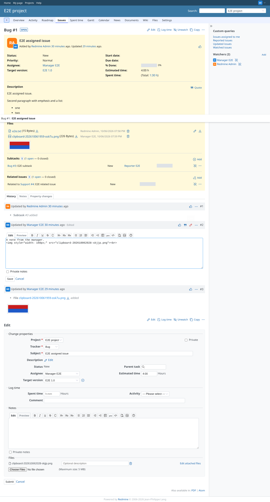
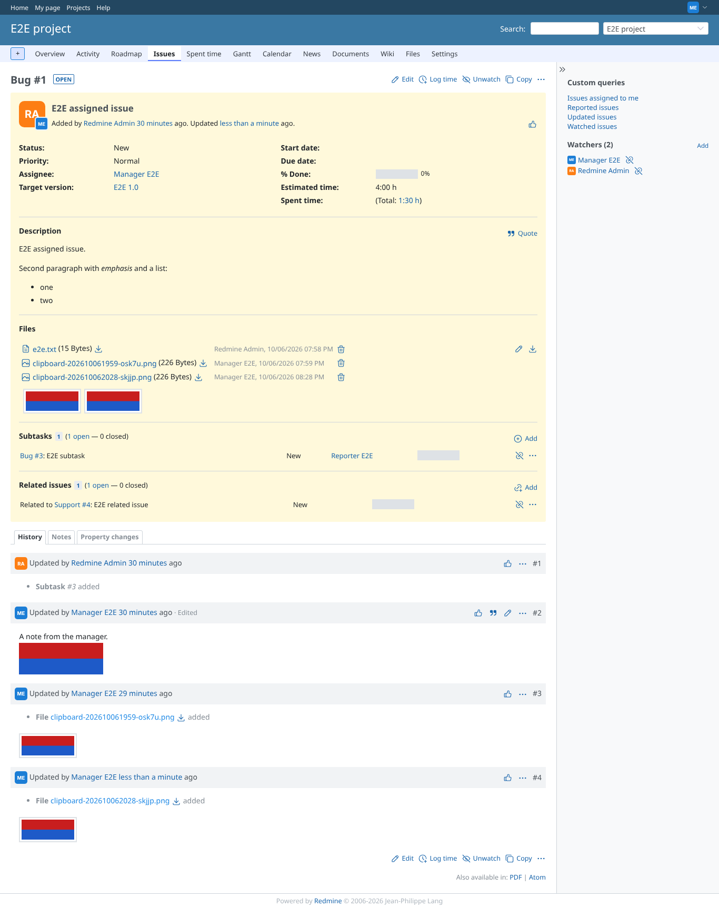
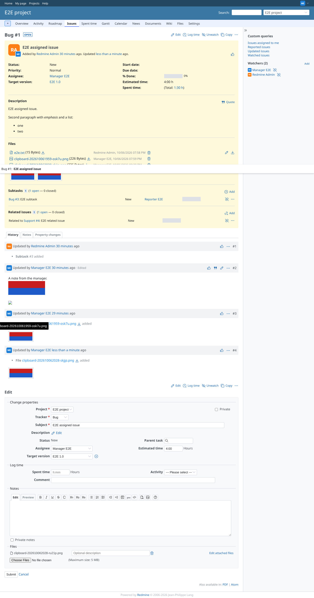
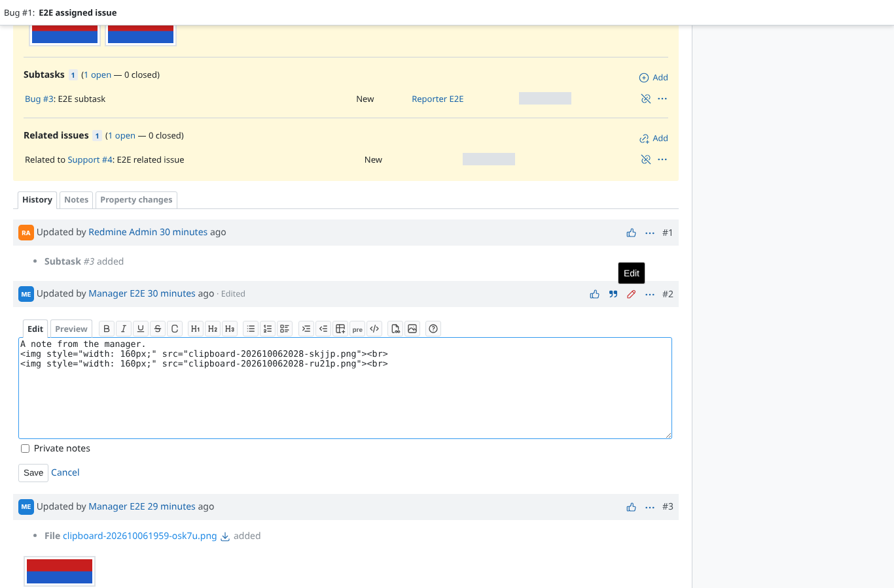
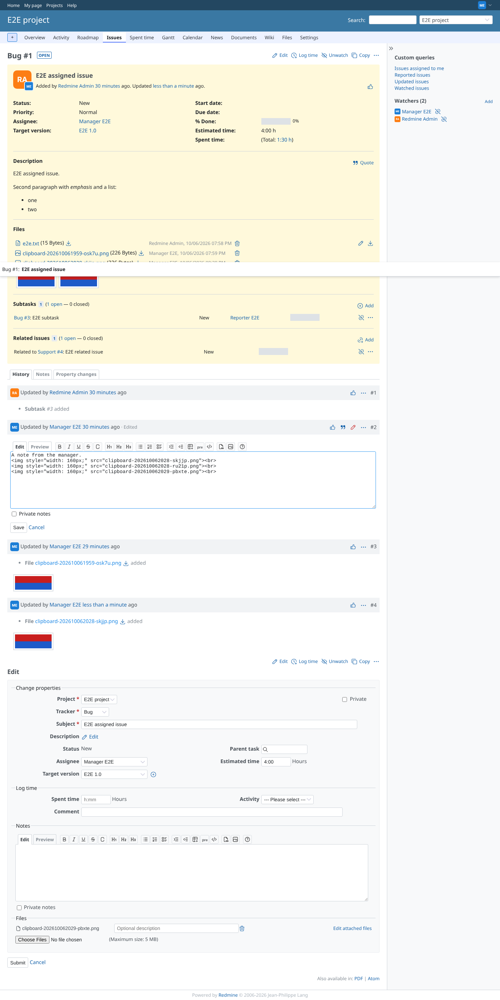
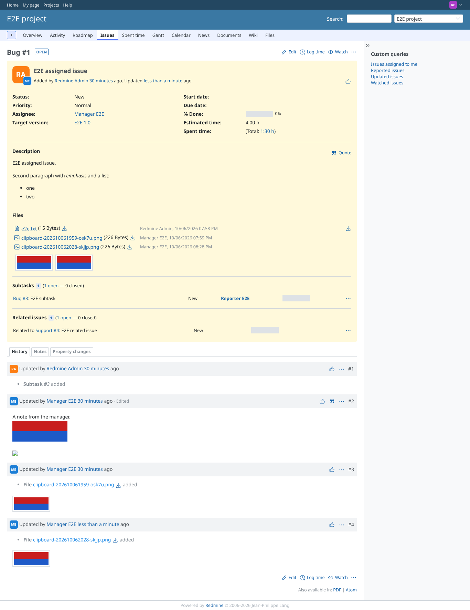
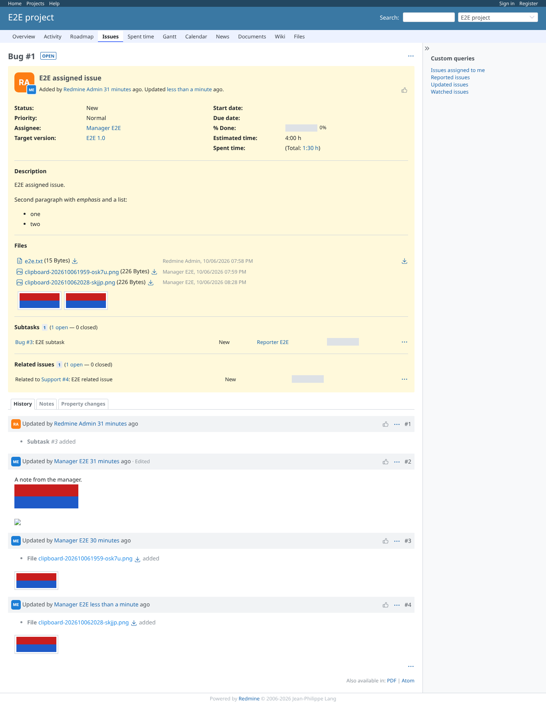

# image-paste

Run 2026-10-06T20:29:19.856Z against http://127.0.0.1:3000.

| screenshot | user | URL | shows |
|---|---|---|---|
|  | manager | `/issues/1` | The pasted image is uploaded and the markup (inserted by Redmine) is in the note: "A note from the manager.\n \n"; the issue form (#update) is open |
|  | manager | `/issues/1` | After saving the note the image is shown inline and is an attachment of the issue |
|  | manager | `/issues/1` | With auto submit off the user is reminded to save the issue: "Remember to save your issue! This ensures that any attachments you've added are properly saved too." |
|  | manager | `/issues/1` | With "Enable Image Paste" off a pasted image does nothing |
|  | manager | `/issues/1` | An image that comes with plain (non-table) text is still uploaded |
|  | reporter | `/issues/1` | A reporter has no edit link on the manager's note: no place to paste an image |
|  | outsider | `/issues/6` | An outsider cannot open an issue of the private project |
|  | anonymous | `/issues/1` | Anonymous users see the issue without an editor |
