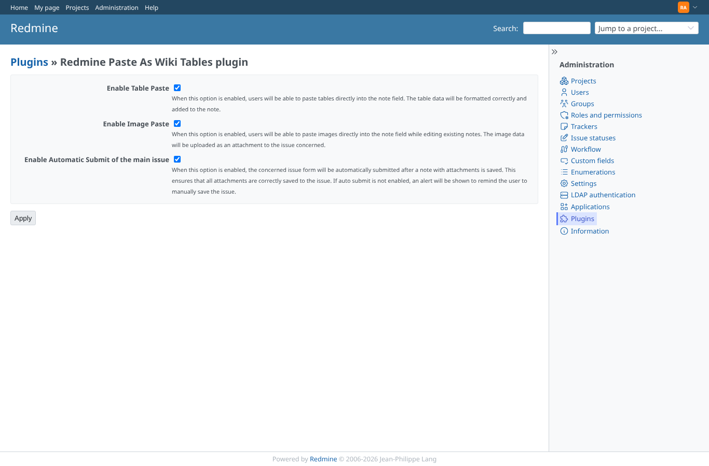
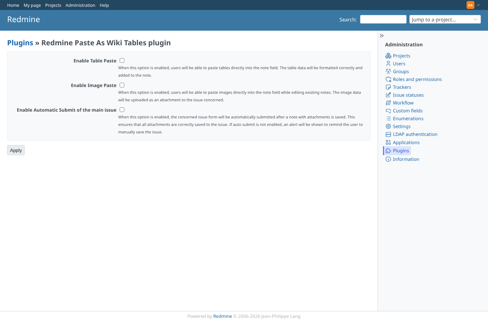
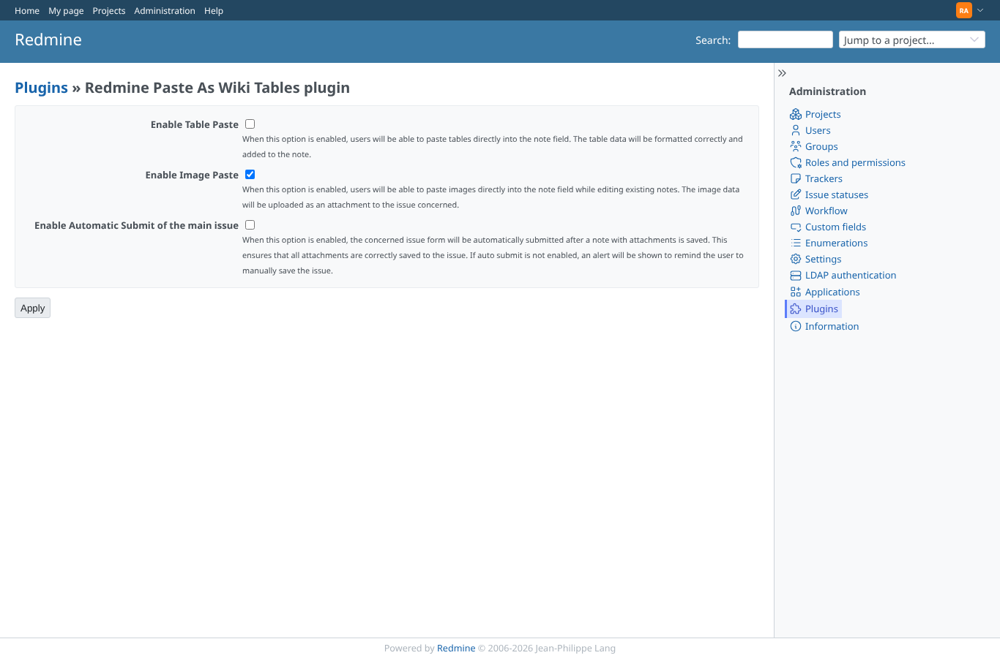

# settings

Run 2026-10-06T20:32:57.986Z against http://127.0.0.1:3000.

| screenshot | user | URL | shows |
|---|---|---|---|
|  | admin | `/settings/plugin/redmine_paste_as_wiki_tables` | The three options are checked after saving them checked |
|  | admin | `/settings/plugin/redmine_paste_as_wiki_tables` | Saving with every option unchecked works and keeps them off |
|  | admin | `/settings/plugin/redmine_paste_as_wiki_tables` | Only image paste is on |
|  | manager | `/settings/plugin/redmine_paste_as_wiki_tables` | A non-admin (even with every project permission) is refused |
|  | anonymous | `/login?back_url=http%3A%2F%2F127.0.0.1%3A3000%2Fsettings%2Fplugin%2Fredmine_paste_as_wiki_tables` | Anonymous users get the login form |
