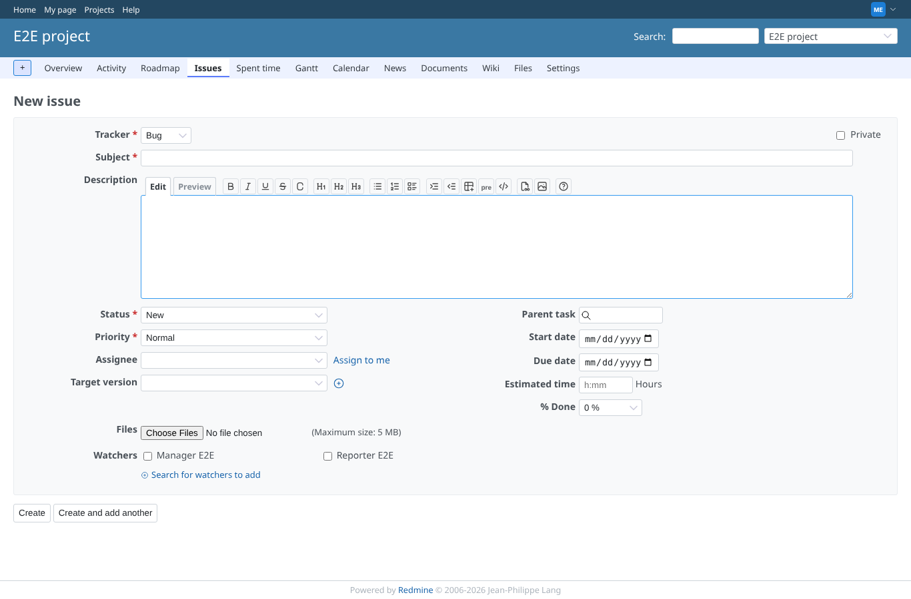
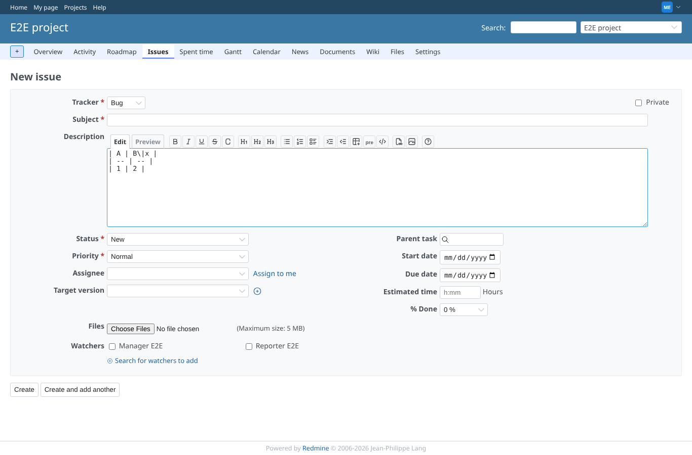
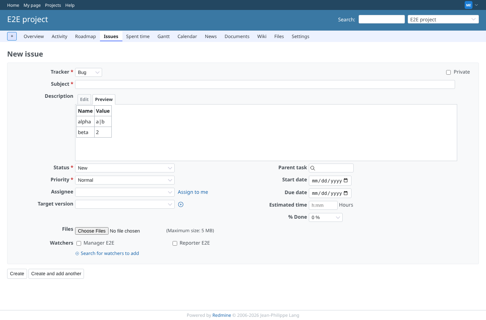
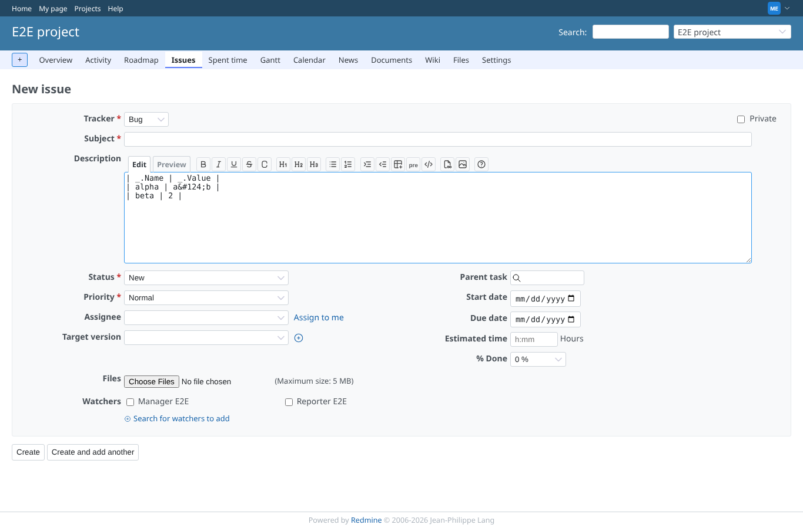
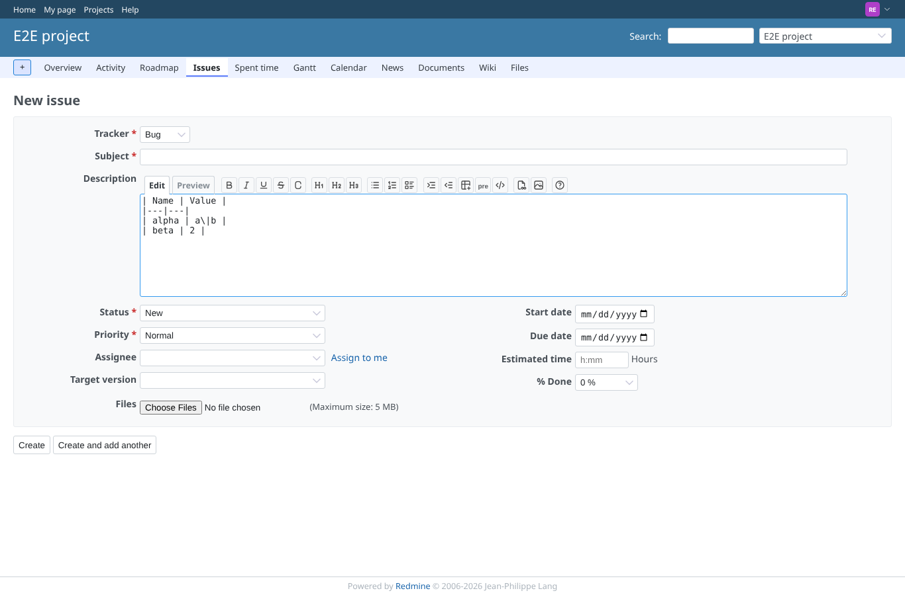

# table-paste

Run 2026-10-07T23:48:47.841Z against http://127.0.0.1:3000.

| screenshot | user | URL | shows |
|---|---|---|---|
|  | manager | `/projects/e2e-project/issues/new` | Tab separated text becomes a CommonMark table; the pipe in a cell is escaped |
|  | manager | `/projects/e2e-project/issues/new` | Pasting in the middle keeps the text after the cursor |
|  | manager | `/projects/e2e-project/issues/new` | A range that starts with an empty cell is still recognised as a table |
|  | manager | `/projects/e2e-project/issues/new` | Plain text and uneven rows are not touched by the plugin |
|  | manager | `/projects/e2e-project/issues/new` | A spreadsheet paste (HTML plus text) gives one table, not two |
|  | manager | `/projects/e2e-project/issues/new` | The preview renders the pasted text as a table |
|  | manager | `/projects/e2e-project/issues/new` | With textile formatting the header cells use _. and the pipe becomes &#124; |
|  | manager | `/projects/e2e-project/issues/new` | With "Enable Table Paste" off the plugin leaves the paste alone |
|  | reporter | `/projects/e2e-project/issues/new` | A reporter gets the same table paste |
|  | outsider | `/projects/e2e-private/issues/new` | An outsider is refused on the private project: no form, no script |
